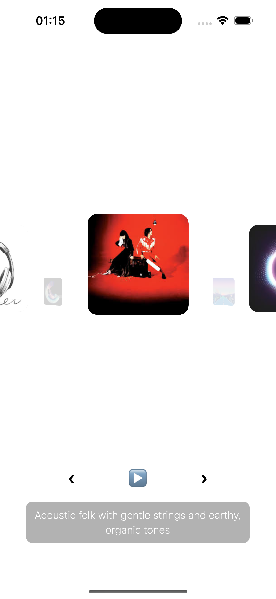
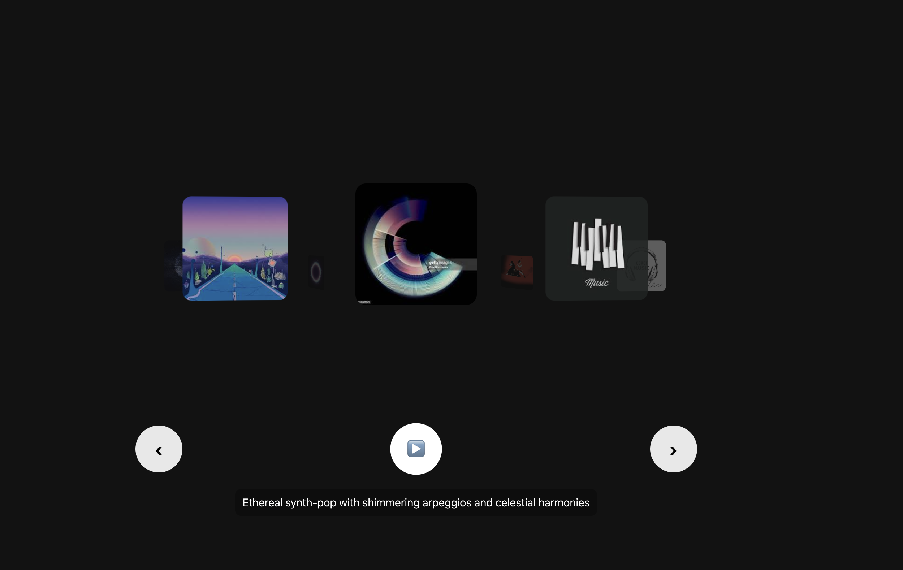

# React Native Music Carousel

A smooth, interactive **3D music carousel** built with **React Native**, **Reanimated 2**, and **Expo AV**. Each album features its own **image, title, artist, description, and audio playback**. The carousel has **next/previous controls**, and audio plays automatically when switching albums if previously playing.  

---

## Features

- **3D Cover Flow-style carousel** using `react-native-reanimated`.
- **Dynamic album descriptions** displayed for each album.
- **Audio playback** using Expo AV with play/pause toggle.
- Smooth animations with custom easing.
- Responsive layout for different screen sizes.

---

## Screenshots




---

## Installation

1. Clone the repository:  

```bash
git clone <repository_url>
cd music-carousel-app
